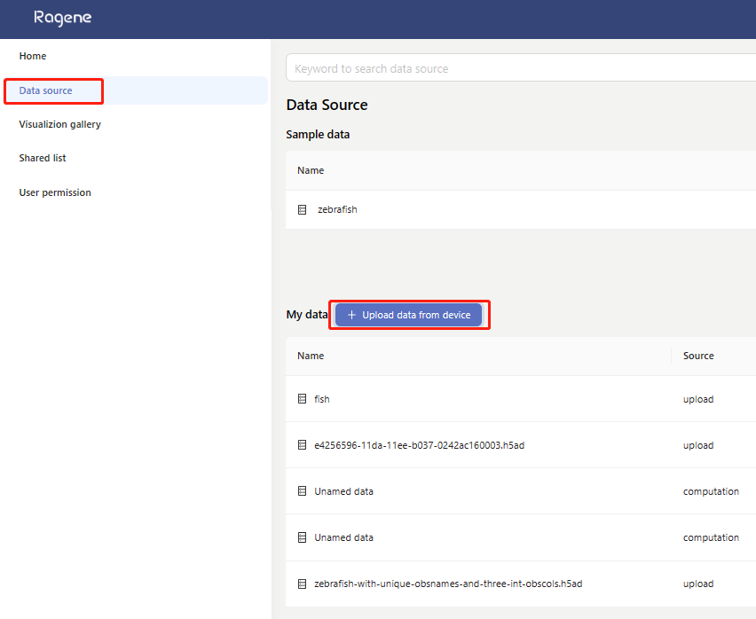

# Platform Login and Registration

## Platform Login
On the login page, users can enter their account credentials (mobile number) and password, then click the **Log in** button to access the platform. If users do not have an account, they can click the **Register** button to proceed with account registration. In case users forget their password, they can click the **Forgot password** button to reset it.

## Account Registration
On the registration page, users need to input their username, password, and mobile number (used as the login account). After entering these details, users can click the **Send** button to receive and input a mobile verification code. If users do not have an invitation code, they can contact customer service by emailing **yuze@raganetwork.com** for assistance.

## Password Reset
On the password reset page, users must enter their mobile number (login account) and click the **Send** button to receive a mobile verification code. Users then input the verification code along with their new password. Once the information is filled in, they can click the **Next step** button to proceed to the password reset result page. If the reset is successful, users can click the **To login** button to return to the login page.

---

# Creation and Management of Analysis Tasks

## Workflow
After logging into the homepage, the **Workflow** tab includes two sections: **Analysis Task** and **Data Source**. 

- In the **Analysis Task** section, users can create and manage analysis tasks and view public analyses at the top of the page to explore examples of analyses provided by Ragomics.  
- In the **Data Source** section, users can import datasets from public databases into their accounts or upload data from local sources.

## Creating an Analysis
Once logged in, users can go to the **Analysis Task** page under the **Workflow** tab and click the **Create New Analysis Task** button to create a new analysis task. 

1. In the pop-up form, users must enter a name for the analysis task. While the task description is optional, it helps the **Agent** module provide more accurate assistance.  
2. Users can choose to enable the **With Guidance** feature. If enabled, the **Pipeline Helper** will automatically launch the first time the user accesses the analysis panel of the task, helping them quickly select an analysis pipeline tailored to their needs.  
3. Once the task is created, users will be directed to its **Analysis Panel**.

# Managing Analysis Tasks

## Viewing and Managing Analysis Tasks
After logging in, users can view and manage previously created analysis tasks in the **Workflow** - **Analysis Task** tab. Each analysis task card contains several buttons for task management:

- **Open Button**: Click to access the **Analysis Panel** of the selected task.
- **Collaborator Management Button**: Click to open the collaborator management page and invite collaborators to participate in the project analysis.
- **Edit Button**: Click to edit the task name and description.
- **Copy Button**: Click to duplicate the current analysis task. Note that the duplicated task will only retain the **Data Source** and any unexecuted analysis pipelines. Analysis results will not be copied.
- **Delete Button**: Click to delete the current analysis task. **This action is irreversible.**
- **Share Button**: Click to access the sharing page. Users can enable sharing for the task and click the quick copy link below to generate a shareable access URL. Other users can use the link to view the shared analysis task but cannot edit it as guest users.

---

## Collaborator Management
When an analysis task requires collaboration with other users, the **Collaborator List** can be opened. 

- Click the **Add Collaborator** button in the top-left corner to invite collaborators.
- Users can assign editing permissions to collaborators as needed.

# Public Analyses and Databases

## Public Analyses
Ragomics provides users with a series of completed analysis examples. Users can directly access these **Public Analyses** to review the analysis process and results. However, users cannot perform any editing actions on these public analyses.

---

## Public Databases
On the **Workflow** - **Data Source** page, users can explore datasets from public databases:

1. Click the **Show More** button to view additional datasets in the public database.
2. Select an interesting dataset and click the **Import** button to add it to the user's account database.

---

# Data Upload and Management

## Data Upload
Ragomics offers two methods for uploading data:

### Method 1
- Navigate to **Workflow** - **Data Source** - **My Data** section.
- Click the **Upload** button to start the data upload process.

### Method 2
- In the **Analysis Panel**, click the **Data Source** tab in the left sidebar.
- Click the **Upload from Device** button to begin uploading data directly from your device.

# Supported Data Formats for Upload in Ragomics

Ragomics currently supports the following five data formats for upload:

## 1. AnnData Upload
- Users can add `.h5ad` files by dragging and dropping or clicking the **Upload** button.  
- Select the corresponding species information and provide a description of the data.  
- Once the file is selected and all information is filled out, click the **Upload** button to start uploading.  
- When the upload status indicates success, the data upload is complete.

---

## 2. 10x Data Upload
1. Enter the data name, species information, and data description.  
2. Click the **Next Step** button, then click **Add a Sample** to create a new sample row.  
3. For multiple samples, add the corresponding number of sample rows.  
4. In each sample row, upload the following three files:  
   - `barcodes.tsv`  
   - `genes.tsv`  
   - `matrix.mtx`  
5. Once all data is uploaded, click the **Assemble** button to complete the upload process.

---

## 3. Assemble AnnData
1. Enter species information and data description, then click the **Next Step** button.  
2. Upload the required files by dragging and dropping or clicking the upload area:  
   - **Mandatory Files**:  
     - In the central **Layers** section, upload `X`, or `unspliced` and `spliced` files.  
     - `var`  
     - `obs`  
   - **Optional Files**:  
     - `obsp`  
     - `obsm`  
     - `varm`  
     - `varp`  
3. Once all files are uploaded, click the **Assemble** button to finalize the AnnData assembly.  
4. Click the **Complete** button to finish the upload process.

---

## 4. FastQ Upload
1. Select the corresponding species information and provide a description of the data.  
2. Click the **Next Step** button.  
3. Add FastQ `.zip` files by dragging and dropping or clicking the central upload area.

---

## 5. Spaceranger Count Upload
1. Enter the data name, select the corresponding species information, and provide a description of the data.  
2. Click the **Next Step** button.  
3. Add Spaceranger Count data by dragging and dropping or clicking the upload area.  
4. On the right side of the upload panel, you can find format requirements and mandatory file examples.  
5. Once the data is uploaded, click the **Assemble** button to complete the data assembly.

### Upload from data source
In the **Data source** management page, click ==Upload data from device== to upload data

  

    

      This is a paragraph on the left. You can provide details about the content
      here, explain the context, or introduce the video that appears on the right.
    

  

  

    <iframe width="100%" height="315" src="https://www.youtube.com/embed/VIDEO_ID" frameborder="0" allowfullscreen></iframe>
  

